```python
from hopfild import neyron_layer_builder as nlb
from hop_parser import imageParser as imp

SIZE = 10

learnShapesFiles = [
        "./learnShape/D.png",
        "./learnShape/H.png",
        "./learnShape/X.png"
]

testShapesFiles = [
        "./testShape/D0.png",
        "./testShape/D10.png",
        "./testShape/D20.png",
        "./testShape/D30.png",
        "./testShape/D35.png",
        "./testShape/D40.png",
        "./testShape/D45.png",
        "./testShape/D50.png",
        "./testShape/D60.png",
        "./testShape/D70.png",
        "./testShape/D80.png",
        "./testShape/D90.png",
        "./testShape/D100.png",

        "./testShape/H0.png",
        "./testShape/H10.png",
        "./testShape/H20.png",
        "./testShape/H30.png",
        "./testShape/H35.png",
        "./testShape/H40.png",
        "./testShape/H45.png",
        "./testShape/H50.png",
        "./testShape/H60.png",
        "./testShape/H70.png",
        "./testShape/H80.png",
        "./testShape/H90.png",
        "./testShape/H100.png",

        "./testShape/X0.png",
        "./testShape/X10.png",
        "./testShape/X20.png",
        "./testShape/X30.png",
        "./testShape/X35.png",
        "./testShape/X40.png",
        "./testShape/X45.png",
        "./testShape/X50.png",
        "./testShape/X60.png",
        "./testShape/X70.png",
        "./testShape/X80.png",
        "./testShape/X90.png",
        "./testShape/X100.png"
]
```

# Д train shape

# Н train shape

# Х train shape


```python
shapes = []
for fileName in learnShapesFiles:
    shape = imp.parse_image_to_shape(fileName)
    if len(shape) == SIZE ** 2:
        print("FIND SHAPE = \"" + fileName + "\"")
        shapes.append(shape)
    else:
        print("FILE IS NOT SHAPE = \"" + fileName + "\"")
```

    FIND SHAPE = "./learnShape/D.png"
    FIND SHAPE = "./learnShape/H.png"
    FIND SHAPE = "./learnShape/X.png"
    


```python
builder = nlb.NeyronLayerBuilder(SIZE ** 2)
for shape in shapes:
    builder.teach(shape)
        
layer = builder.build()
```

# Д test shape
## Д 0% noise test shape

## Д 10% noise test shape
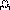
## Д 20% noise test shape
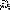
## Д 30% noise test shape
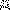
## Д 35% noise test shape
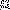
## Д 40% noise test shape
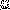
## Д 45% noise test shape
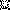
## Д 50% noise test shape
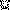
## Д 60% noise test shape
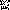
## Д 70% noise test shape
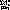
## Д 80% noise test shape
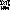
## Д 90% noise test shape
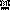
## Д 100% noise test shape


# Н test shape
## Н 0% noise test shape
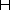
## Н 10% noise test shape
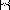
## Н 20% noise test shape
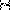
## Н 30% noise test shape
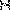
## Н 35% noise test shape
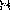
## Н 40% noise test shape
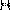
## Н 45% noise test shape
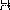
## Н 50% noise test shape
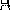
## Н 60% noise test shape
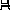
## Н 70% noise test shape
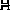
## Н 80% noise test shape
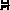
## Н 90% noise test shape
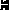
## Н 100% noise test shape
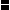


# Х test shape
## Х 0% noise test shape
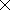
## Х 10% noise test shape
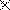
## Х 20% noise test shape
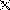
## Х 30% noise test shape
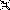
## Х 35% noise test shape
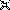
## Х 40% noise test shape
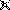
## Х 45% noise test shape
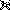
## Х 50% noise test shape
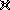
## Х 60% noise test shape
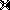
## Х 70% noise test shape
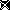
## Х 80% noise test shape
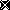
## Х 90% noise test shape
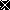
## Х 100% noise test shape
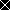


```python
for testFile in testShapesFiles:    
    result = layer.test_shape(imp.parse_image_to_shape(testFile))
    out = "result/" + testFile.rsplit(".")[1].split("/")[-1] + "Res.png"
    imp.from_shape_to_image(result, out, SIZE)
```

# Д results
## Д 0% noise   
<input type="checkbox" enabled checked> valid </input>

## Д 10% noise
<input type="checkbox" enabled checked> valid </input>

## Д 20% noise
<input type="checkbox" enabled checked> valid </input>

## Д 30% noise
<input type="checkbox" enabled> valid </input>

## Д 35% noise
<input type="checkbox" enabled> valid </input>

## Д 40% noise
<input type="checkbox" enabled> valid </input>

## Д 45% noise
<input type="checkbox" enabled> valid </input>

## Д 50% noise
<input type="checkbox" enabled> valid </input>

## Д 60% noise
<input type="checkbox" enabled> valid </input>

## Д 70% noise
<input type="checkbox" enabled> valid </input>

## Д 80% noise
<input type="checkbox" enabled> valid </input>

## Д 90% noise
<input type="checkbox" enabled> valid </input>

## Д 100% noise
<input type="checkbox" enabled> valid </input>


# Н results
## Н 0% noise
<input type="checkbox" enabled checked> valid </input>

## Н 10% noise
<input type="checkbox" enabled checked> valid </input>

## Н 20% noise
<input type="checkbox" enabled checked> valid </input>

## Н 30% noise
<input type="checkbox" enabled> valid </input>

## Н 35% noise
<input type="checkbox" enabled> valid </input>
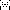
## Н 40% noise
<input type="checkbox" enabled> valid </input>

## Н 45% noise
<input type="checkbox" enabled> valid </input>

## Н 50% noise
<input type="checkbox" enabled> valid </input>

## Н 60% noise
<input type="checkbox" enabled> valid </input>
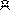
## Н 70% noise
<input type="checkbox" enabled> valid </input>

## Н 80% noise
<input type="checkbox" enabled> valid </input>

## Н 90% noise
<input type="checkbox" enabled> valid </input>

## Н 100% noise
<input type="checkbox" enabled> valid </input>


# Х results
## Х 0% noise
<input type="checkbox" enabled checked> valid </input>

## Х 10% noise
<input type="checkbox" enabled checked> valid </input>

## Х 20% noise
<input type="checkbox" enabled checked> valid </input>

## Х 30% noise
<input type="checkbox" enabled checked> valid </input>

## Х 35% noise
<input type="checkbox" enabled checked> valid </input>

## Х 40% noise
<input type="checkbox" enabled> valid </input>

## Х 45% noise
<input type="checkbox" enabled> valid </input>

## Х 50% noise
<input type="checkbox" enabled> valid </input>

## Х 60% noise
<input type="checkbox" enabled> valid </input>

## Х 70% noise
<input type="checkbox" enabled> valid </input>

## Х 80% noise
<input type="checkbox" enabled> valid </input>

## Х 90% noise
<input type="checkbox" enabled> valid </input>

## Х 100% noise
<input type="checkbox" enabled> valid </input>


